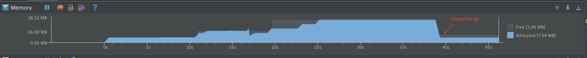

# BigImageViewer


Big image viewer supporting pan and zoom, with very little memory usage and full
featured image loading choices. Powered by [Subsampling Scale Image
View](https://github.com/davemorrissey/subsampling-scale-image-view),
[Fresco](https://github.com/facebook/fresco),
[Glide](https://github.com/bumptech/glide), and
[Picasso](https://github.com/square/picasso). Even with gif and webp support!

## Demo



pan and zoom               |  gif support
:-------------------------:|:-------------------------:
  |  

## Getting started

### Add the dependencies

**Note: please put this download url at the first of your `repositories` part, otherwise, gradle may search in wrong place.**

``` gradle
allprojects {
    repositories {
        mavenCentral()
    }
}

implementation 'com.github.piasy:BigImageViewer:1.8.1'

// load with fresco
implementation 'com.github.piasy:FrescoImageLoader:1.8.1'

// load with glide
implementation 'com.github.piasy:GlideImageLoader:1.8.1'

// progress pie indicator
implementation 'com.github.piasy:ProgressPieIndicator:1.8.1'

// support thumbnail, gif and webp with Fresco
implementation 'com.github.piasy:FrescoImageViewFactory:1.8.1'

// support thumbnail and gif with Glide
implementation 'com.github.piasy:GlideImageViewFactory:1.8.1'
```

### Initialize

``` java
// MUST use app context to avoid memory leak!
// load with fresco
BigImageViewer.initialize(FrescoImageLoader.with(appContext));

// or load with glide
BigImageViewer.initialize(GlideImageLoader.with(appContext));

// or load with glide custom component
BigImageViewer.initialize(GlideCustomImageLoader.with(appContext, CustomComponentModel.class));
```

**Note that** if you've already used Fresco in your project, please change
`Fresco.initialize` into `BigImageViewer.initialize`.

### Add the BigImageView to your layout

``` xml
<com.github.piasy.biv.view.BigImageView
        android:id="@+id/mBigImage"
        android:layout_width="match_parent"
        android:layout_height="match_parent"
        app:failureImage="@drawable/failure_image"
        app:failureImageInitScaleType="center"
        app:optimizeDisplay="true"
        />
```

You can disable display optimization using `optimizeDisplay` attribute, or
`BigImageView.setOptimizeDisplay(false)`, which will disable animation for long
image, and the switch between thumbnail and origin image.

### Show the image

``` java
BigImageView bigImageView = (BigImageView) findViewById(R.id.mBigImage);
bigImageView.showImage(Uri.parse(url));
```

## Usage

### Animated image support

Since 1.5.0, BIV support display animated image, e.g. gif and animated webp, to achieve that,
you need set a custom `ImageViewFactory` via `biv.setImageViewFactory`:

``` java
// FrescoImageViewFactory is a prebuilt factory, which use Fresco's SimpleDraweeView
// to display animated image, both gif and webp are supported.
biv.setImageViewFactory(new FrescoImageViewFactory());

// GlideImageViewFactory is another prebuilt factory, which use ImageView to display gif,
// animated webp is not supported (although it will be displayed with ImageView,
// but it won't animate).
biv.setImageViewFactory(new GlideImageViewFactory());
```

Node: if the image is not gif or animated webp, then it will be displayed by SSIV,
the image type is not determined by its file extension, but by its file header magic code.

### Thumbnail support

To show a thumbnail before the big image is loaded, you can call below version of `showImage`:

``` java
bigImageView.showImage(Uri.parse(thumbnail), Uri.parse(url));
```

Note: make sure that you have already called `setImageViewFactory`.

### Shared element transition support (experimental)

Since 1.6.0, BIV has experimental support for shared element transition,
but it has following known issues:

+ The shared image may flicker during enter transition, or become white after return transition,
when using Fresco, see [Fresco issue #1445](https://github.com/facebook/fresco/issues/1445);
+ The shared image may flicker after return transition, especially after you zoomed SSIV;

You can play with the demo app to evaluate the shared element transition support.

### Download progress indicator

``` java
bigImageView.setProgressIndicator(new ProgressPieIndicator());
```

There is one built-in indicator, `ProgressPieIndicator`, you can implement your
own indicator easily, [learn by example](/ProgressPieIndicator).

### Prefetch

You can prefetch images in advance, so it could be shown immediately when user
want to see it.

``` java
BigImageViewer.prefetch(uris);
```

### Save image into gallery

``` java
bigImageView.setImageSaveCallback(new ImageSaveCallback() {
    @Override
    public void onSuccess(String uri) {
        Toast.makeText(LongImageActivity.this,
                "Success",
                Toast.LENGTH_SHORT).show();
    }

    @Override
    public void onFail(Throwable t) {
        t.printStackTrace();
        Toast.makeText(LongImageActivity.this,
                "Fail",
                Toast.LENGTH_SHORT).show();
    }
});

// should be called on worker/IO thread
bigImageView.saveImageIntoGallery();
```

### Get current image file

``` java
// only valid when image file is downloaded.
File path = bigImageView.getCurrentImageFile();
```

### Image init scale type

You can set the normal image scale type using `initScaleType` attribute, or `setInitScaleType`.

``` java
mBigImageView.setInitScaleType(BigImageView.INIT_SCALE_TYPE_CENTER_CROP);
```

| value | effect |
| ------| ------ |
| center | Center the image in the view, but perform no scaling. |
| centerCrop | Scale the image uniformly (maintain the image's aspect ratio) so that both dimensions (width and height) of the image will be equal to or larger than the corresponding dimension of the view (minus padding). The image is then centered in the view. |
| centerInside | Scale the image uniformly (maintain the image's aspect ratio) so that both dimensions (width and height) of the image will be equal to or less than the corresponding dimension of the view (minus padding). The image is then centered in the view. |
| fitCenter | Scales the image so that it fits entirely inside the parent. At least one dimension (width or height) will fit exactly. Aspect ratio is preserved. Image is centered within the parent's bounds. |
| fitEnd | Scales the image so that it fits entirely inside the parent. At least one dimension (width or height) will fit exactly. Aspect ratio is preserved. Image is aligned to the bottom-right corner of the parent. |
| fitStart | Scales the image so that it fits entirely inside the parent. At least one dimension (width or height) will fit exactly. Aspect ratio is preserved. Image is aligned to the top-left corner of the parent. |
| fitXY | Scales width and height independently, so that the image matches the parent exactly. This may change the aspect ratio of the image. |
| custom | Scale the image so that both dimensions of the image will be equal to or less than the maxScale and equal to or larger than minScale. The image is then centered in the view. |
| start | Scale the image so that both dimensions of the image will be equal to or larger than the corresponding dimension of the view. The top left is shown. |

Note: SSIV only support centerCrop, centerInside, custom and start, other scale types are
treated as centerInside, while other scale types may be used by animated image types.

### Failure image

You can set a local failure image using `failureImage` attribute, or `setFailureImage`.

It will displayed using an `ImageView` when the image network request fails. If not specified,
nothing is displayed when the request fails.

#### Failure image init scale type

You can set the failure image scale type using `failureImageInitScaleType` attribute,
or `setFailureImageInitScaleType`.

Any value of [ImageView.ScaleType](https://developer.android.com/reference/android/widget/ImageView.ScaleType.html)
is valid. Default value is `ImageView.ScaleType.FIT_CENTER`. It will be ignored if there is
no failure image set.

#### Tap to retry

When failure image is specified, you can tap the failure image then it will retry automatically.
That's the default behavior, you can change it using `tapToRetry` attribute, or `setTapToRetry`.

### Image load callback

You can handle the image load response by creating a new `ImageLoader.Callback`
and overriding the key callbacks

```java
ImageLoader.Callback myImageLoaderCallback = new ImageLoader.Callback() {
    @Override
    public void onCacheHit(int imageType, File image) {
      // Image was found in the cache
    }

    @Override
    public void onCacheMiss(int imageType, File image) {
      // Image was downloaded from the network
    }

    @Override
    public void onStart() {
      // Image download has started
    }

    @Override
    public void onProgress(int progress) {
      // Image download progress has changed
    }

    @Override
    public void onFinish() {
      // Image download has finished
    }

    @Override
    public void onSuccess(File image) {
      // Image was retrieved successfully (either from cache or network)
    }

    @Override
    public void onFail(Exception error) {
      // Image download failed
    }
}
```

Then setting it as the image load callback

```java
mBigImageView.setImageLoaderCallback(myImageLoaderCallback);
```

The `onSuccess(File image)` is always called after the image was retrieved
successfully whether from the cache or the network.

For an example, see ImageLoaderCallbackActivity.java

### Cancel image loading

BIV will cancel image loading automatically when detach from window, you can also call `cancel`
to cancel it manually.

You can also call `BigImageViewer.imageLoader().cancelAll();` in an appropriate time,
e.g. Activity/Fragment's `onDestroy` callback, to cancel all flying requests, avoiding memory leak.

### Full customization

You can get the SSIV instance through the method below:

``` java
public SubsamplingScaleImageView getSSIV() {
    return mImageView;
}
```

Then you can do anything you can imagine about SSIV :)

Note: you should test whether SSIV is null, because the image could be a gif,
then it won't be displayed by SSIV.

### Custom SSIV support

You can even use your own custom SSIV, by calling `biv.setImageViewFactory()`,
passing in a factory that override `createStillImageView`, and return your custom SSIV.

### Custom Glide components support

You can use your custom Glide's [components](https://bumptech.github.io/glide/doc/configuration.html#registering-components).
If you have customized your Glide's configuration, you are able to apply that configuration to BIV too, to do that you only have to initialize BIV in this way:

```java
BigImageViewer.initialize(GlideCustomImageLoader.with(appContext, CustomComponentModel.class));
```

Where `CustomComponentModel.class` is the Glide's model component. That's it!

For more detailed example, please refer to [the example project](https://github.com/Piasy/BigImageViewer/tree/master/app/src/main/java/com/github/piasy/biv/example/glide).

## Caveats

+ Handle permission when you want to save image into gallery.
+ When you want load local image file, you can create the Uri via
`Uri.fromFile`, but the path will be url encoded, and may cause the image loader
fail to load it, consider using `Uri.parse("file://" + file.getAbsolutePath())`.
+ When using with RecyclerView or ViewPager, the recycled BIV doesn't know
it should clear the loaded image or reload the image,
so you need manually notify it in some way,
see [issue 107](https://github.com/Piasy/BigImageViewer/issues/107),
and [issue 177](https://github.com/Piasy/BigImageViewer/issues/177).
+ Crash on Android 4.x device? You could force gradle to use a specific version of OkHttp (some version earlier than 3.13.0), by adding this block to your module's build.gradle, please note that it should be added at the top level, not inside any other block:

    ```gradle

    configurations {
      all {
        resolutionStrategy {
          eachDependency { DependencyResolveDetails details ->
            if (details.requested.group == 'com.squareup.okhttp3' &&
                details.requested.name ==
                'okhttp') {
              // OkHttp drops support before 5.0 since 3.13.0
              details.useVersion '3.12.6'
            }
          }
        }
      }
    }
    ```

## Why another big image viewer?

There are several big image viewer libraries,
[PhotoDraweeView](https://github.com/ongakuer/PhotoDraweeView),
[FrescoImageViewer](https://github.com/stfalcon-studio/FrescoImageViewer), and
[Subsampling Scale Image
View](https://github.com/davemorrissey/subsampling-scale-image-view).

They both support pan and zoom. PhotoDraweeView and FrescoImageViewer both use
Fresco to load image, which will cause extremely large memory usage when showing
big images. Subsampling Scale Image View uses very little memory, but it can
only show local image file.

This library show big image with Subsampling Scale Image View, so it only uses
very little memory. And this library support using different image load
libraries, so it's full featured!

If you are interested in how does this library work, you can refer to [this
issue](https://github.com/Piasy/BigImageViewer/issues/8), and [Subsampling Scale
Image View](https://github.com/davemorrissey/subsampling-scale-image-view).

## Performance

Memory usage of different libraries:

| \- | PhotoDraweeView | FrescoImageViewer | BigImageViewer |
| ------| ------ | ------ | ------ |
| 4135\*5134 | 80MB | 80MB | 2~20 MB |

## Todo

+ [x] GlideImageLoader
+ [x] Save image file to gallery
+ [x] Optimize long image showing effect, thanks for [razerdp](https://github.com/razerdp)
+ [x] Optimize "double tap to zoom" effect, thanks for [razerdp](https://github.com/razerdp)
+ [x] Loading animation
+ [x] Downloading progress
+ [x] Thumbnail support
+ [ ] Component to display image list, with memory optimization
+ [x] Fail image
+ [x] Retry when fail
+ [ ] PicassoImageLoader, track [this issue](https://github.com/square/picasso/issues/506)

Those features are offered by image load libraries, and they should be easy to
implement, but I don't have enough time currently. So your contributions are
welcome!

When you submit PR, please conform the [code style of this project](https://github.com/Piasy/java-code-styles),
which is customized from Square Android style.
